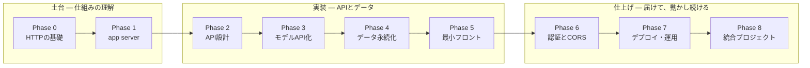

# webapp-study

MLモデルをプロダクトにするためのWebアプリケーション学習ロードマップと実装記録。

モデルや分析ロジックを作る力はすでにある。ここで埋めるのは、それを「呼び出せる形」にして
人に届けるまでの技術——app server・API・最低限のフロントエンド・運用の部分。

## 想定するユースケース

1. 既存のMLモデルをHTTP経由で呼び出せるAPIとして公開する
2. そのAPIを叩く最低限のフロントエンド（社内ダッシュボード等）を用意する
3. app serverの仕組みを理解し、本番運用で起きることを自力で判断できるようになる

## 全体像

9つのフェーズは3つの塊に分かれる。土台（HTTPとapp server自体の理解）→ 実装（APIとして
モデルを公開し、データを残す）→ 仕上げ（人が使える形にし、動かし続ける）。矢印は依存関係——
前段の理解なしに次段のコードを書いても、動く理由が説明できない状態になる。



同じ塊の中は行き来してよいが、塊をまたぐ矢印は前段の理解が前提になる。

図解版（HTML）はこちら: https://claude.ai/code/artifact/f8e0c38c-3ef6-4583-a572-e0ccb6d4aa19

## 進捗

- [ ] Phase 0 — HTTPとクライアント・サーバーモデル
- [ ] Phase 1 — アプリケーションサーバーとASGI/WSGI
- [ ] Phase 2 — バックエンドAPI設計の基礎
- [ ] Phase 3 — MLモデルをAPI化する
- [ ] Phase 4 — データの永続化
- [ ] Phase 5 — 最低限のフロントエンド
- [ ] Phase 6 — 認証・CORS・秘密情報の扱い
- [ ] Phase 7 — デプロイと運用
- [ ] Phase 8 — 統合プロジェクト

## 各フェーズの詳細

### Phase 0 — HTTPとクライアント・サーバーモデル

**なぜ**: ブラウザとサーバーが何をやり取りしているかが体に入っていないと、この先すべての
エラーが「なぜ動かないか分からない魔法」になる。

**仕組み**: リクエスト/レスポンス、メソッド（GET/POST）、ステータスコード、ヘッダー、
ボディ。特定の言語やフレームワークに属さない、Web全体の共通言語。

**手を動かす**: Pythonの標準ライブラリだけで最小サーバーを立て、curlとブラウザ両方から
観察する。

```bash
python3 -m http.server 8000
# 別ターミナルから
curl -v http://localhost:8000
```

`-v`で表示される生のヘッダーを読み、ブラウザの開発者ツール（Networkタブ）で同じ通信を
見比べる。

### Phase 1 — アプリケーションサーバーとASGI/WSGI

**なぜ**: 「Pythonの関数」と「HTTPリクエストを受けられるサービス」の間に何が挟まっているか
を知らないと、本番で起きる詰まりを自分で切り分けられない。

**仕組み**: Webサーバー（Nginx等・静的配信とプロキシ）、アプリケーションサーバー
（Gunicorn/Uvicorn・プロセス/ワーカー管理）、アプリケーションコード（あなたが書くPython）
の3層は役割が別。ASGI/WSGIはアプリケーションサーバーとアプリケーションコードの間の
「呼び出し規約」——サーバーがどんな形でリクエストをPython関数に渡すかの約束事。WSGIは
同期・1リクエスト1スレッド前提、ASGIは非同期・並行リクエストを1プロセスで捌ける設計。

**手を動かす**: FastAPI（ASGI前提のフレームワーク）を素のUvicornで起動し、リクエストの
ライフサイクルをログで観察する。

```bash
pip install fastapi uvicorn
```

```python
# main.py
from fastapi import FastAPI
app = FastAPI()

@app.get("/ping")
async def ping():
    return {"status": "ok"}
```

```bash
uvicorn main:app --reload --log-level debug
```

次に`time.sleep`を挟んだ同期エンドポイントと`asyncio.sleep`を挟んだ非同期エンドポイントを
両方作り、複数タブから同時にアクセスして応答速度の違いを実際に見る。ここでASGIが「なぜ
並行処理に強いか」が説明ではなく体験として分かる。

### Phase 2 — バックエンドAPI設計の基礎

**仕組み**: ルーティング（URLと関数の対応）、リクエスト/レスポンスの型定義（Pydantic
モデル）、バリデーション、自動生成されるAPIドキュメント（OpenAPI）。

**手を動かす**: 簡単なCRUD API（例: メモやタスクの登録・取得・削除）を1つ作り切る。
`/docs`にアクセスして自動生成されたAPI仕様を確認する。

### Phase 3 — MLモデルをAPI化する

**なぜ**: ここが本丸。手元の分析コードを「呼び出し可能なサービス」に変える工程そのもの。

**仕組み**: モデルをいつロードするか（起動時に1回ロードして使い回す vs リクエスト毎に
ロード——後者は遅く、事故のもと）、入出力スキーマの設計（Pydanticでモデルの入力特徴量・
出力を型として固定する）、推論処理が重い場合にPhase 1の非同期の話がどう効いてくるか
（CPUバウンドな推論はasyncの恩恵を受けにくく、別プロセス/スレッドプールに逃がす判断が
要る）。

**手を動かす**: scikit-learnの簡単な分類器（またはあなたの手元にある実際のモデル）を
`joblib`で保存し、FastAPIの起動イベントでロード、推論エンドポイントとして公開する。

### Phase 4 — データの永続化

**仕組み**: DBの基本（テーブル・主キー・外部キー）、ORM（PythonオブジェクトとSQLの対応
づけ）、マイグレーション（スキーマ変更の履歴管理）。

**手を動かす**: SQLiteとSQLAlchemyで、Phase 3の推論API呼び出しごとに「入力・出力・
タイムスタンプ」を記録するテーブルを作る。

### Phase 5 — 最低限のフロントエンド

**なぜ**: JS/TSフルスタックへ深入りする方針ではないので、ここは「APIを人が触れる画面に
する」ための最小限にとどめる。

**仕組み**: HTMLフォーム、`fetch`によるAPI呼び出し、JSONの受け渡し。フレームワークなしの
素のHTML/JSで十分。

**手を動かす**: Phase 3の推論APIを叩き、結果を表示する1枚のHTMLページを作る。FastAPI側で
静的ファイルとして配信する。

### Phase 6 — 認証・CORS・秘密情報の扱い

**仕組み**: 社内の複数人が使う前提で最低限必要になるもの——APIキーやトークンによる認証、
ブラウザのCORS制約（フロントとAPIのオリジンが違う場合に何が起きるか）、環境変数による
secrets管理（コードにキーを埋め込まない）。

**手を動かす**: Phase 3のAPIに簡単なAPIキー認証を追加し、キーなしのリクエストが拒否
されることを確認する。

### Phase 7 — デプロイと運用

**なぜ**: Phase 1で学んだapp serverの理解を、実際の運用構成として完成させる段階。

**仕組み**: Uvicorn単体（開発用）からGunicorn配下でUvicornワーカーを複数動かす構成
（本番向け・プロセスを増やして並行性を確保）への移行、リバースプロキシ（Nginx等が静的
配信・TLS終端・複数アプリの振り分けを担う）、コンテナ化（環境差異の排除）、ヘルスチェック。

**手を動かす**: これまで作ったAPIをDockerイメージにし、`docker-compose`でAPIコンテナと
DBコンテナを一緒に起動する。ローカルで本番に近い構成を再現する。

### Phase 8 — 統合プロジェクト

**なぜ**: 個々の技術要素は分かっても、全部を1つのプロダクトとしてつなげた経験がないと
「実装できる」とは言えない。

**作るもの**: ここまでの要素を通しで使い、業務で扱っているものに近いテーマのミニ
プロダクトを1つ作り切る——モデル推論API＋推論ログのDB保存＋最小フロント＋認証＋
Docker化。冒頭の3つのユースケースがすべて満たされた状態がゴール。
