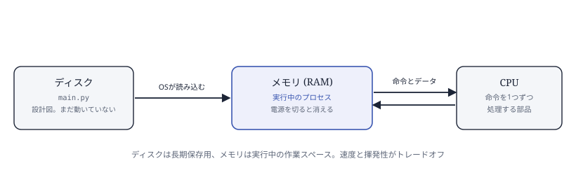
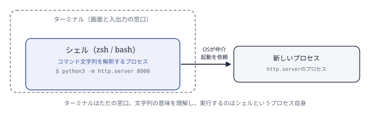
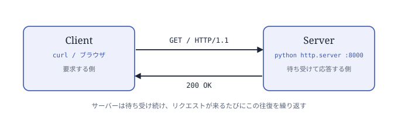
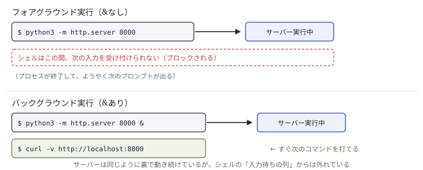
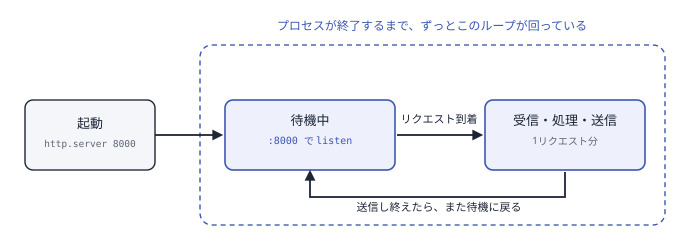
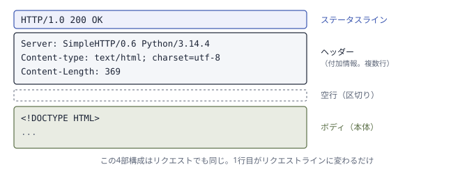

# Phase 0 学習ノート — HTTPとクライアント・サーバーモデル

[README](../README.md)の学習ロードマップにおけるPhase 0（9段階中の最初、
「土台」の位置づけ）の記録。このフェーズを「なぜ」やるかはREADMEのPhase 0
セクションに書いてあるので、ここでは実際に手を動かして確認した内容とその
理解を残す。

## コンピュータの基本要素

Webの話に入る前に、コンピュータの中身を最低限おさえる。

- **ディスク**（ストレージ。SSDやHDD）: プログラムやデータを長期間しまっておく場所。
  電源を切っても中身は消えない。今回使う`.py`ファイルも、これが置かれている場所。
- **メモリ**（RAM）: 今動いているプログラムが、実行中に使うデータを一時的に置く場所。
  ディスクより高速に読み書きできる代わりに、電源を切ると中身は消える。
- **CPU**: メモリに置かれた命令を1つずつ読み取り、実際に計算・処理する部品。



**OS**（オペレーティングシステム）は、これらのハードウェアを管理し、プログラムの
実行を仲介するソフトウェア。WindowsやmacOSがこれにあたる。この後出てくる
`python3 ...`というコマンドも、実体は「このプログラムを実行してほしい」という
OSへの依頼。

**プログラムとプロセスの違い**: ディスクに保存された`.py`ファイルは、ただの
テキストで書かれた「命令の設計図」であり、それ自体は何もしていない（レシピの
書かれた紙が、それだけでは料理を作らないのと同じ）。OSがこの設計図を読み込み、
メモリに展開して、CPUに命令を1つずつ実行させ始めると、初めて「動いている」
状態になる。この動いている実体をプロセスと呼ぶ。同じ`.py`ファイルからでも、
実行するたびに新しいプロセスが生まれる。

## ターミナルとシェル

この先、コマンドを実行する場面がたびたび出てくる。ここで動いているものは、
実は2つに分かれている。

- **ターミナル**（端末）: 文字を表示し、キー入力を受け取るだけの「窓口」。
  それ自体はコマンドの意味を理解していない。
- **シェル**: ターミナルの中で動いている1つのプロセス（zshやbashなど）。
  打ち込まれた文字列を受け取り、それが何のプログラムをどんな引数で実行して
  ほしいという意味かを解釈して、OSに新しいプロセスの起動を依頼する。

つまりシェルは、前節のOS（ハードウェアを管理し、プログラムの実行を仲介する
ソフトウェア）の機能を、人間が打てるコマンドという形で使うための仲介役。
「コマンドを打つ」とは、シェルというプロセスに「このプログラムを、この引数で
実行してくれ」と伝えていること。



## クライアントとサーバー

要求する側と応答する側に役割を分けておくと、1つのリソースを複数の相手が共有できる。
その応答する役目を担うのがサーバー。



サーバーに要求を送る側を担うプログラムはいくつもあり、ブラウザはその1つ。今回は
`curl`というコマンドラインのプログラムを使う——画面には何も描画せず、リクエストを
送ってレスポンスをテキストのまま表示するだけの、観察に向いた道具。curlもブラウザも
役割上は同じ「クライアント」——HTTPという共通の形式で話しかけさえすれば区別
されない。「サーバー」という言葉自体は、応答するプログラムを指すことも、それが
動くマシン自体を指すこともあり、文脈で読み分けが要る。

`localhost:8000`の`localhost`は自分自身のマシンを指す名前。`:8000`のポート番号が
なぜ要るかというと、1台のマシンのIPアドレスは1つでも、その上で複数のプログラムが
同時にネットワーク通信をすることがあるから。IPアドレスが「マシンの住所」だとすると、
ポート番号は「その中のどの窓口宛てか」を指定する番号にあたる。今回は1台のマシンの
中でサーバーとクライアントの両方を動かして観察しているが、実際のWebサービスでは
両者が別マシンにあり間をネットワークが繋ぐだけで、役割分担の構造自体は変わらない。

## サーバーを起動して、起動している状態を観察する

以下のコマンドで、Python標準ライブラリに入っている簡易HTTPサーバーを起動する。

```bash
nohup python3 -m http.server 8000 > /tmp/http_server.log 2>&1 &
disown
```

- `python3 -m http.server 8000` — `-m`はPythonに「後ろの名前をモジュールとして
  実行してくれ」と伝えるオプション。`http.server`はPython標準ライブラリに入っている
  モジュールで、単体で簡易HTTPサーバーとしても動くように作られている。`8000`は
  ポート番号。
- 末尾の`&` — シェルは通常、実行したコマンドが終わるまで次の入力を受け付けない。
  この「今シェルが入力を渡している最中のジョブ」をフォアグラウンドジョブと呼ぶ。
  `&`を付けると、そのコマンドはフォアグラウンドではなくバックグラウンドジョブとして
  起動される——シェルは起動だけしたらすぐ次の入力を受け付けられるようになる。
  プロセス自体は同じように動き続けていて、変わるのは「シェルが今どちらの相手を
  しているか」だけ。

  
- `nohup` — 端末を閉じると、シェルは動いているプロセスに`SIGHUP`という「もう切るよ」
  を意味する終了シグナルを送る。`nohup`はプロセス自身に「`SIGHUP`が来ても無視しろ」
  という設定をして起動する仕組み。対策の場所は**プロセス側**。`&`だけだと端末を
  閉じた瞬間にサーバーも道連れで落ちる。
- `> /tmp/http_server.log 2>&1` — ログの行き先の指定。`>`は標準出力をファイルに書き出す、
  `2>&1`は標準エラー出力(2)を標準出力(1)と同じ場所に合流させる。これがないとログが
  端末に流れ続けて邪魔になる。
- `disown` — バックグラウンドで動かしたこのジョブを、シェルの「ジョブテーブル」
  （バックグラウンドで動かしたプロセスの管理台帳）から削除する。シェルがそのプロセスを
  自分の管理下と見なさなくなるので、シェル終了時に`SIGHUP`を送る対象からも外れる。
  対策の場所は**シェル側**。`nohup`が「シグナルを送られても平気にする」のに対し、
  `disown`は「そもそも送信対象から外れる」——別経路の対策なので、両方使うと
  二重に保険がかかる。

このコマンドを実行すると、前節の通りOSがプログラムをメモリに読み込み、プロセスとして
動かし始める。ただし、プロセスが動いているだけでは、外からの接続は受け取れない。
OSに対して「ポート8000宛ての通信は自分（このプロセス）に渡してほしい」と登録する
操作が要り、これをlisten（待ち受け）と呼ぶ。「起動している」とは、プロセスが動き
続けていて、かつこのlistenの状態にあることを指す。プロセスは一度起動したら、
リクエストが来るまで何もせず待ち、来たら処理して送り返し、また待つ——という
ループを繰り返す。このループが回り続けている間ずっと「起動している」。



このループは、プロセスを終了させるまで動き続ける。終了のさせ方は主に2つ——
動かしている端末で`Ctrl+C`を押す（シェルからそのプロセスへ`SIGINT`という中断
シグナルが送られる）か、`kill`コマンドでプロセスの番号を指定する（デフォルトで
`SIGTERM`という終了シグナルが送られる）か。`SIGHUP`・`SIGINT`・`SIGTERM`は
別々のシグナルだが、特別な対応をしていないプログラムはどれを受け取っても終了する
のが既定の挙動。`nohup`はこのうち`SIGHUP`だけを無視する設定にしているので、
`Ctrl+C`や`kill`はこのサーバーにも変わらず効く。ただし`Ctrl+C`は今動かしている
端末の中のプロセスにしか送れないので、`nohup`で端末から切り離した今回は
`kill`を使うことになる。

## HTTPリクエスト/レスポンスの構造

HTTP（HyperText Transfer Protocol）は、クライアントとサーバーがどんな形式で
やり取りするかを定めた取り決め。この「事前に合意しておく手順・書式のルール」を
プロトコルと呼ぶ。作った人も動かす環境も違うクライアントとサーバーが、初対面でも
問題なく会話できるのは、両者が同じプロトコルに従っているから。

HTTPメッセージ（リクエストもレスポンスも共通）は、常に4つの部分でできている。

1. **1行目**: リクエストなら`GET / HTTP/1.1`のようなリクエストライン、レスポンス
   なら`HTTP/1.0 200 OK`のようなステータスライン。
2. **ヘッダー**: `名前: 値`という形式で1行ずつ並ぶ、本文とは別の付加情報。
   「これは何のデータ形式か」「何バイトか」「誰が送っているか」など、やり取りを
   成立させるために要るが、本文そのものではない情報を運ぶ。
3. **空行**: ヘッダーがそこで終わったことを示す区切り。
4. **ボディ**: 実際のデータ本体。省略されることもある。



起動したサーバーに、以下のコマンドでアクセスする。

```bash
curl -v http://localhost:8000/ 2>&1 | head -40
```

- `curl` — HTTPリクエストを送るコマンドラインツール。ブラウザが裏でやっている
  「リクエストを組み立てて送り、レスポンスを受け取る」処理を、GUIなしで直接叩ける。
- `-v`（verbose） — 何も付けないとレスポンスのボディしか表示されない。付けると、
  送受信したヘッダーも含めて表示される。
- `2>&1` — curlの`-v`が出す通信ログは標準エラー出力に流れる仕様なので、後段のパイプに
  渡すために標準出力へ合流させている。
- `| head -40` — `|`（パイプ）は前のコマンドの出力を次のコマンドの入力として渡す
  仕組み。`head -40`は渡されたものの最初の40行だけを表示する。

このコマンドを実行すると、やり取りの生の姿が見える。`>`がクライアントから送った
リクエスト、`<`がサーバーから返ってきたレスポンス。

```
> GET / HTTP/1.1
> Host: localhost:8000
> User-Agent: curl/8.7.1
> Accept: */*
>
< HTTP/1.0 200 OK
< Server: SimpleHTTP/0.6 Python/3.14.4
< Content-type: text/html; charset=utf-8
< Content-Length: 369
<
```

**リクエスト側**: `GET`（メソッド：何をしたいか）、`/`（パス：どのリソースか）、
`HTTP/1.1`（プロトコルのバージョン）の3つが1行に入っている。`HTTP/1.1`は
`プロトコル名/メジャーバージョン.マイナーバージョン`という書き方で、「自分は
HTTP 1.1の作法まで話せる」とクライアントが伝えている。バージョンが上がるほど
通信は効率化されていて、例えば1.0は1回のやり取りごとに接続を切るのに対し、
1.1は同じ接続を使い回せる。`Host`以下がヘッダーで、今回の例では`Host`（どの
サーバー宛てか）、`User-Agent`（クライアント自身が何のソフトウェアか名乗る）、
`Accept`（どんな形式のレスポンスなら受け入れられるか。`*/*`は「何でもいい」の
意味）の3つが付いている。メソッドは「何をしたいか」の種類で、今回使った
GET以外にも用途ごとに決まっている。

| メソッド | 意味 |
|---------|------|
| GET | リソースを取得する（今回使ったもの） |
| POST | 新しいデータを送って作る |
| PUT | 既存のデータを丸ごと置き換える |
| DELETE | 削除する |

**レスポンス側**: `200 OK`が「うまくいった」を表すステータスコード。`Server`は
サーバー側のソフトウェア名とバージョンを名乗るヘッダー（`SimpleHTTP/0.6
Python/3.14.4`）。`Content-type`はボディの中身が何か、`Content-Length`はボディが
何バイトか（コンピュータ上のデータは常にバイト——8ビットのまとまり——の並びとして
やり取りされる。369はそのバイト数）をクライアントに伝えている。この2つのヘッダーが
あるから、クライアント側は「受け取ったバイト列をどう解釈すればいいか」を判断できる。
今回のボディの中身はHTML（HyperText Markup Language）——ブラウザが画面として
描画するための文書の書き方。curlは描画せず、受け取ったテキストをそのまま
表示している。

リクエストは`HTTP/1.1`なのに、レスポンスは`HTTP/1.0`になっている。バージョンが
食い違っているように見えるが、これは`python3 -c "import http.server;
print(http.server.BaseHTTPRequestHandler.protocol_version)"`で確認した通り、
`http.server`モジュールの実装が応答のバージョンを常に`HTTP/1.0`に固定している
ため。HTTPの仕組みそのものの話ではなく、この最小サーバーの実装の特性。

存在しないパスにアクセスすると、ステータスコードが変わるのも確認できる。

```bash
curl -v http://localhost:8000/nonexistent 2>&1 | grep -E "^[<>]"
```

`grep -E "^[<>]"`は、渡された行の中から「行頭が`<`か`>`の行」だけを抜き出す
フィルタ。ヘッダーの行だけを見たいときに、HTMLのボディ部分を省くために使う。

```
> GET /nonexistent HTTP/1.1
< HTTP/1.0 404 File not found
```

サーバー側のコードが「このパスに対応するファイルがあるか」を判断し、その結果として
ステータスコードとボディを組み立てて返している。ステータスコードは先頭の桁で
大まかに分類されている。

| 範囲 | 意味 | 今回見た例 |
|------|------|-----------|
| 2xx | 成功 | `200 OK` |
| 3xx | リダイレクト（別の場所を見てほしい） | — |
| 4xx | クライアント側の問題（リクエストの仕方がおかしい） | `404 File not found` |
| 5xx | サーバー側の問題（処理中に何か壊れた） | — |

## 動作確認した内容

- [x] `curl -v`でリクエスト/レスポンスのヘッダーを実際に見た（200 OK）
- [x] 存在しないパスでステータスコードが変わることを確認した（404 File not found）
- [ ] ブラウザの開発者ツール（Networkタブ）で同じ内容を見た
